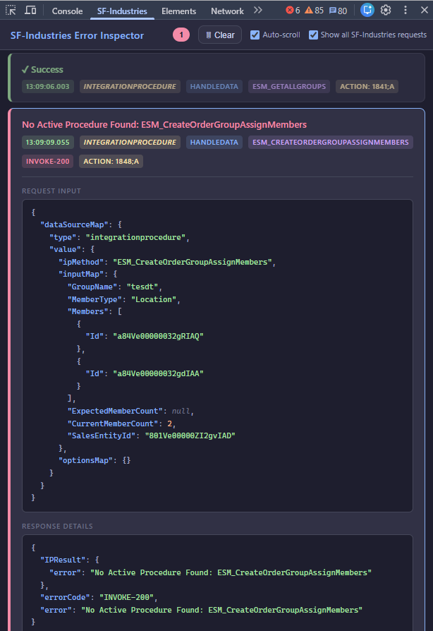

# SF-Industries Error Inspector — Chrome DevTools Extension

A Chrome DevTools extension that monitors **Salesforce Industries (Vlocity)** network traffic and surfaces hidden errors that are invisible in the standard Network tab.

## The Problem

Salesforce Industries requests (Integration Procedures, DataRaptors, Apex Remote calls) often return HTTP 200 with `"state": "SUCCESS"` even when the business logic fails. The actual error is buried deep inside nested, URL-encoded JSON — making debugging painful and time-consuming.

**Example:** An Integration Procedure call returns:
```json
{
  "state": "SUCCESS",
  "returnValue": "{\"IPResult\":{\"error\":\"No Active Procedure Found: ESM_CreateOrderGroupAssignMembers\"},\"errorCode\":\"INVOKE-200\"}"
}
```

This extension catches these hidden errors automatically.

## Features

- **Auto-detects hidden errors** in SUCCESS responses (IP errors, DR errors, Apex Remote errors)
- **Filters SF-Industries traffic only** — shows requests with a `dataSourceMap` (IPs, DRs, Apex Remote) plus generic OmniStudio ApexAction invokes (e.g. `GenericInvoke2NoCont`), ignoring unrelated Aura noise
- **Shows dataSource type** — tags each request as `integrationprocedure`, `dataraptor`, `apexremote`, `apexaction`, etc.
- **Shows procedure/bundle name** — instantly see which IP, DR bundle, or Apex class.method failed
- **Decodes nested JSON** — fully parses and prettifies the deeply encoded payloads
- **Displays parsed request inputs** — see exactly what parameters were sent without manual decoding
- **Click header to expand** — full request/response details; text in expanded area is selectable/copyable
- **Dark theme UI** — matches Chrome DevTools aesthetic
- **Error count badge** — quick visibility of how many errors occurred
- **Show all SF-Industries requests** toggle — view successful calls too, or filter to errors only
- **Auto-scroll** — keeps the view at the latest entry (toggleable)

## Installation

1. Open Chrome and navigate to `chrome://extensions/`
2. Enable **Developer mode** (toggle in the top right)
3. Click **Load unpacked**
4. Select this folder: `sf-aura-error-inspector/`
5. Open Chrome DevTools (F12) on any Salesforce org
6. Look for the **"SF-Industries"** tab in the DevTools panel

## Usage

1. Open any Salesforce Lightning page
2. Open DevTools (F12)
3. Navigate to the **"SF-Industries"** panel tab
4. Interact with the page — errors and requests appear automatically
5. **Click any card header** to expand and see full request/response details
6. Text in expanded details is fully selectable and copyable

## What It Detects

| Error Type | Example |
|---|---|
| Missing Integration Procedure | `No Active Procedure Found: ESM_xxx` |
| IP/DR execution errors | `errorCode: INVOKE-200` (with actual error message) |
| Explicit ERROR state | Action state = "ERROR" |
| Nested error fields | `error`, `errorMessage`, `IPResult.error`, `DRResult.error` |

**Smart filtering:** Responses with `"error": "OK"` or `"error": "success"` are correctly treated as successful — not false positives.

## Supported DataSource Types

| Type | What's shown |
|---|---|
| `integrationprocedure` | IP method name (e.g., `ESM_CreateOrderGroupAssignMembers`) |
| `dataraptor` | Bundle name (e.g., `ESMExtractOrderMemberCount`) |
| `apexremote` | Class.method (e.g., `CpqAppHandler.getItemReverseQuantity`) |
| `apexaction` | Class.method of a generic OmniStudio invoke (e.g., `IntegrationProcedureService.ESM_AddOMOGToWCOIsCopyToEO`) |

## Screenshot



## Tips

- **"Show all SF-Industries requests"** is enabled by default — toggle off to see only errors
- The **dataSource type** tag helps distinguish between IPs, DRs, and Apex calls at a glance
- The **procedure name** tag helps you quickly identify which component failed
- **Request Input** section shows the decoded parameters — useful for reproducing issues

## Privacy Policy

This extension collects no personal data. See [PRIVACY_POLICY.md](PRIVACY_POLICY.md) for details.

> **Chrome Web Store submission:** paste the following URL into the Privacy Policy field in the developer dashboard:  
> `https://github.com/noriabits/SF-Industries-Error-Inspector/blob/main/PRIVACY_POLICY.md`
